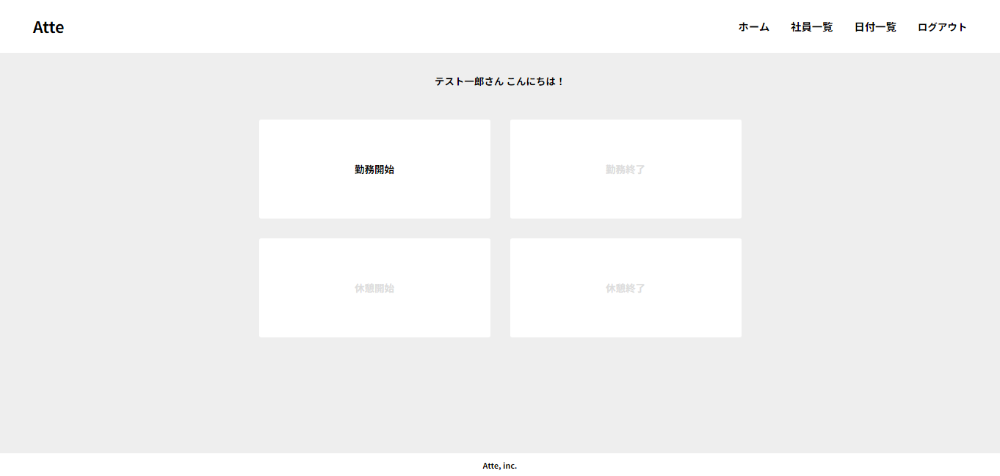
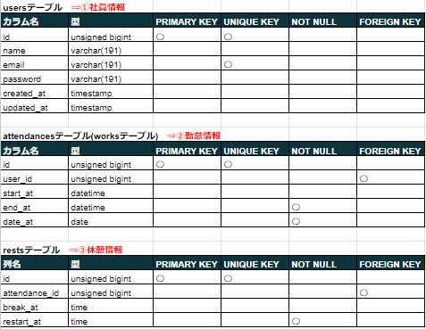
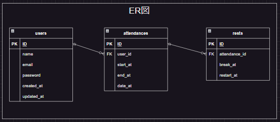
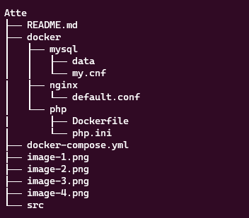
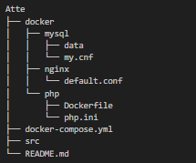

# アプリケーション情報
■ アプリケーション名 
・Atte

■ 概要 
・社員の勤怠管理を行うシステム 
    (社員の出勤状況と休憩状況を管理する)

■ トップ画像

## 作成した目的
・仮企業の人事評価のため

## アプリケーションURL
ローカル環境で作成しています。 
[アプリ] 
  localhost/ 
[phpMyAdmin] 
  localhost:8080 
[MailHog] 
  localhost:8025 

## 他のリポジトリ

## 機能一覧
・新規登録 
・メール認証 
・ログイン 
・勤務時間(勤務開始～勤務登録) 
・勤務時間内の休憩時間(休憩開始～休憩終了)の登録 
・日付別勤怠情報の取得 
・社員一覧情報の取得 
・社員別勤怠情報の取得 
・ログアウト

## 使用技術(実行環境)
■ 使用言語 
・HTML 
・CSS 
・JavaScript 
・PHP 8.2.7

■ 使用フレームワーク 
・Laravel Framework 8.83.27

■ 使用認証方法 
・Fortify

■ メール認証 
MailHog

## テーブル設計

## ER図

## 画面遷移図

## 環境構築
■ 開発環境 
・土台 
　Docker 
　LinuxOS 
・操作 
  ubuntu 
　VSCode 
・サーバー 
　nginx 
・データベース 
　mysql 
　phpMyAdmin 
・管理 
  Git 
　GitHub

■ ディレクトリ構成 

## その他
■ ダミーデータ 
下記の内容で、seederファイルを登録しています。 
[内容] 
・名前　　　　　　：テスト一郎～テスト十郎 
・メールアドレス　：test1@example.com～test10@example.com 
・パスワード　　  　：test7777 
[件数] 
・ユーザーデータ　　　　　：10件 
・出勤データ、休憩データ　：各550件 

作成の際に(1)が必要です。(※のため) 
※attendancesレコード作成時に、user_idに固定数(1～10)を代入 
※restsレコード作成時に、attendance_idに固定数(1～550)を代入 
(1)php artisan migrate:fresh 
(2)php artisan db:seed

■ メール認証 
新規登録時には、メール認証を行っています。 
ローカル環境の為、MailHogを使用しています。 
新規登録で「メール送信済ページ」に遷移した際には、http://localhost:8025で認証確認をお願いします。 
※「社員情報の登録」を押して、メインページへ画面遷移します。

■ テスト実施 
・基本的なテスト(値のチェック) 
・アクセステスト(正しくアクセスできるかチェック) 
・データベーステスト(データベースへの値の挿入、データ存在チェック) 
