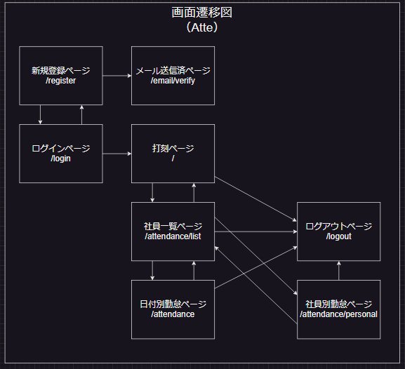

# アプリケーション情報
■ アプリケーション名
・Atte

■ 概要
・社員の勤怠管理を行うシステム
    (社員の出勤状況と休憩状況を管理する)

■ トップ画像

## 作成した目的
・仮企業の人事評価のため

## アプリケーションURL
ローカル環境で作成しています。
[アプリ]
localhost/
[phpMyAdmin]
localhost:8080
[MailHog]
localhost:8025

## 他のリポジトリ

## 機能一覧
・新規登録
・メール認証
・ログイン
・勤務時間(勤務開始～勤務登録)
・勤務時間内の休憩時間(休憩開始～休憩終了)の登録
・日付別勤怠情報の取得
・社員一覧情報の取得
・社員別勤怠情報の取得
・ログアウト

## 使用技術(実行環境)
■ 使用言語
・HTML
・CSS
・JavaScript
・PHP 8.2.7

■ 使用フレームワーク
・Laravel Framework 8.83.27

■ 使用認証方法
・Fortify

■ メール認証
MailHog

## テーブル設計

## ER図

## 画面遷移図

## 環境構築
■ 開発環境
・土台
　Docker
　LinuxOS
・操作
  ubuntu
　VSCode
・サーバー
　nginx
・データベース
　mysql
　phpMyAdmin
・管理
  Git
　GitHub

■ ディレクトリ構成
Atte
├── docker
│   ├── mysql
│   │   ├── data
│   │   └── my.cnf
│   ├── nginx
│   │   └── default.conf
│   └── php
│       ├── Dockerfile
│       └── php.ini
├── docker-compose.yml
├── src
└── README.md

## その他
■ ダミーデータ
下記の内容で、seederファイルを登録しています。
[内容]
・名前　　　　　　：テスト一郎～テスト十郎
・メールアドレス　：test1@example.com～test10@example.com
・パスワード　　  ：test7777
[件数]
・ユーザーデータ　　　　　：10件
・出勤データ、休憩データ　：各550件

作成の際に(1)が必要です。(※のため)
※attendancesレコード作成時に、user_idに固定数(1～10)を代入
※restsレコード作成時に、attendance_idに固定数(1～550)を代入
(1)php artisan migrate:fresh
(2)php artisan db:seed

■ メール認証
新規登録時には、メール認証を実装しています。
ローカル環境の為、MailHogを使用しています。
新規登録情報を入力後に、下記でメール認証を行ってください。
http://localhost:8025/
※「社員情報の登録」を押して、メインページへ画面遷移します。
